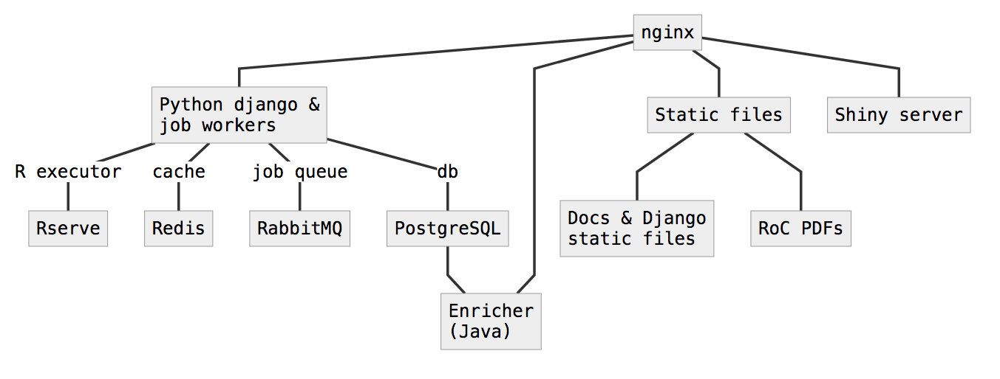

The NTP sandbox is composed of multiple docker containers, as specified in the following docker-compose files:

- [staging](https://gitlab.niehs.nih.gov/ods/sandbox/blob/master/docker-compose-staging.yml)
- [production](https://gitlab.niehs.nih.gov/ods/sandbox/blob/master/docker-compose-production.yml)

A diagram describing container layout is below:

The main entrypoint into the NTP sandbox is a Python django web-application. Other non-root paths may redirect to other applications by nginx (e.g. shiny apps, drug matrix, etc.).

On the **staging-server**, resources (postgres, redis, rserve, rabbitmq) are exposed on their native ports to allow external connections, behind the VPN firewall. On **production**, these connections are not available and applications are only connected via the docker-compose network.

Authorization and authentication are application specific; some apps are open to anyone, and some require authentication. For more details, click the link for each application.
