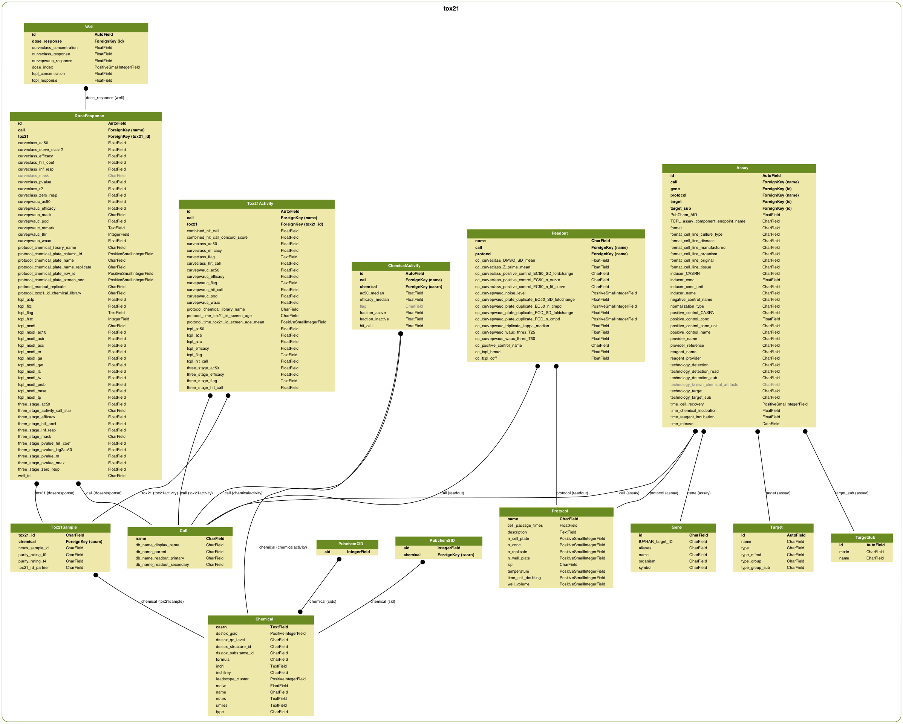

# Tox21 hit-call comparison

## Purpose

A django web-application for [Tox21](https://ntp.niehs.nih.gov/results/tox21/index.html) data storage and data browsing. There are currently four different analysis pipelines for Tox21 data (EPA NCCT TCPL, NCATS CurveClass, NTP CurveP, NTP Three-stage); this application is designed to explore similarities and differences with the results of these approaches.

## Application details

- Staging: [https://sandbox-staging.ntp.niehs.nih.gov/tox21/home/](https://sandbox-staging.ntp.niehs.nih.gov/tox21/home/)
- Production: ✘ (coming soon)

Written as a django application; uses postgresSQL database and Redis for caching.

### Database schema

To browse the database, [connect](/services/#postgresql) to the staging-server database. The database schema is shown below (open image in a new tab to view full screen):


Last updated: 2017-03-31

## Developer instructions

### Extract Transform Load (ETL) tox21 data

The data originally in tox 21 database was created manually by processing dozens of input files in various formats into an intermediate CSV representation. Loading data in the database is a multi-step process. First, ensure the database schema is synced and delete existing tox21 data:

```bash
python manage.py migrate
python manage.py clear_tox21_db
```
Raw data for ETL are available to load here:

    smb://ntp-nas.niehs.nih.gov/ntp-tools-dev/sandbox/neurotox/2017-03-13-raw.zip

Create CSVs from the raw data which can be imported into the database:

```bash
python manage.py create_tox21_csv /path/to/data/ /path/to/csv-output/
```

CSV files for the raw data are available here:

    smb://ntp-nas.niehs.nih.gov/ntp-tools-dev/sandbox/neurotox/2017-03-13-csv.zip

Finally, load CSVs into the database (~1 hr):

```bash
python manage.py load_tox21_csv /path/to/csv-output/
```

### Loading/dumping an existing database

If the data is already loaded into a database, it's easier to create a database dump and load the dump. To create a dump (in a directory format so that we can generate the dump in parallel, which can subsequently be zipped), takes ~10 min:

```bash
pg_dump sandbox \
    --clean \
    --no-owner \
    --format=directory \
    --jobs=4 \
    -t tox21_assay \
    -t tox21_call \
    -t tox21_chemical \
    -t tox21_chemicalactivity \
    -t tox21_doseresponse \
    -t tox21_gene \
    -t tox21_protocol \
    -t tox21_pubchemcid \
    -t tox21_pubchemcid_chemical \
    -t tox21_pubchemsid \
    -t tox21_readout \
    -t tox21_target \
    -t tox21_targetsub \
    -t tox21_tox21activity \
    -t tox21_tox21sample \
    -t tox21_well \
    -f ~/Desktop/tox21db
```

To load the database, unzip the zip file if data are not already in a directory format, then load (~10 min):

```bash
pg_restore \
    --dbname=sandbox \
    --clean \
    --if-exists \
    --exit-on-error \
    --disable-triggers \
    --jobs=4 \
    ~/Desktop/tox21db
```
