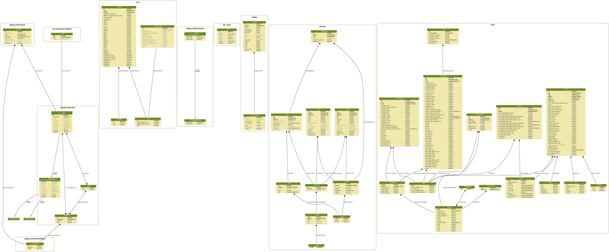
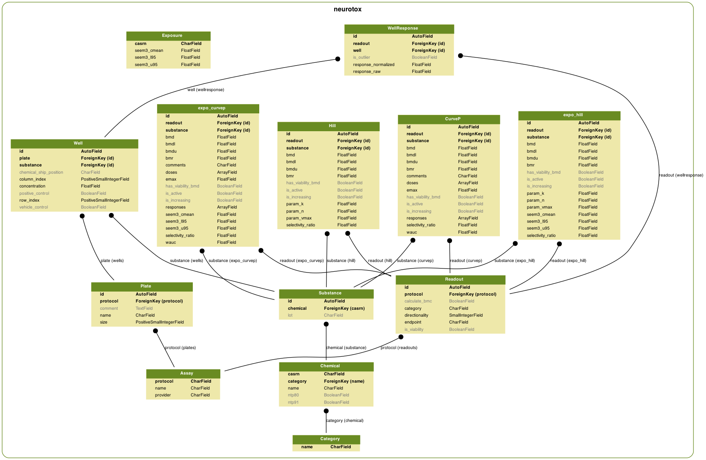

# Django ORM schema definitions

The full database diagram is diagram is shown above. Note that these
diagrams are very large, so you can right click and view all images
in a new browser window to zoom in and explore.            
## neurotox

                 

### neurotox_assay

- Database table name: neurotox_assay
- Django model name: neurotox.models.Assay

**Concrete fields:**

| Name | Type | Attributes     | Help text |
| --- | --- | --- | --- |
| protocol | CharField | <ul><li>max_length: 64</li><li>unique: True</li><li>primary_key: True</li></ul> | 
| name | CharField | <ul><li>max_length: 128</li></ul> | 
| provider | CharField | <ul><li>max_length: 32</li></ul> | 

**Many to many and reverse relations:**

- ManyToOneRel: [neurotox_plate](#neurotox_plate)                    
- ManyToOneRel: [neurotox_readout](#neurotox_readout)                    

### neurotox_plate

- Database table name: neurotox_plate
- Django model name: neurotox.models.Plate

**Concrete fields:**

| Name | Type | Attributes     | Help text |
| --- | --- | --- | --- |
| id | AutoField | <ul><li>unique: True</li><li>blank: True</li><li>primary_key: True</li></ul> | 
| protocol_id (in django: protocol) | ForeignKey | <ul><li>table: [neurotox_assay](#neurotox_assay)</li><li>django model: neurotox.models.Assay</li><li>null: False</li></ul> | 
| name | CharField | <ul><li>max_length: 64</li></ul> | 
| size | PositiveSmallIntegerField | <ul></ul> | 
| comment | TextField | <ul><li>blank: True</li></ul> | 

**Many to many and reverse relations:**

- ManyToOneRel: [neurotox_well](#neurotox_well)                    

### neurotox_readout

- Database table name: neurotox_readout
- Django model name: neurotox.models.Readout

**Concrete fields:**

| Name | Type | Attributes     | Help text |
| --- | --- | --- | --- |
| id | AutoField | <ul><li>unique: True</li><li>blank: True</li><li>primary_key: True</li></ul> | 
| protocol_id (in django: protocol) | ForeignKey | <ul><li>table: [neurotox_assay](#neurotox_assay)</li><li>django model: neurotox.models.Assay</li><li>null: False</li></ul> | 
| endpoint | CharField | <ul><li>max_length: 64</li></ul> | 
| category | CharField | <ul><li>max_length: 32</li></ul> | 
| is_viability | BooleanField | <ul><li>blank: True</li></ul> | 
| calculate_bmc | BooleanField | <ul><li>blank: True</li></ul> | 
| directionality | SmallIntegerField | <ul><li><ul>choices:<li>-1: Negative only</li><li>0: Negative and positive</li><li>1: Positive only</li><li>999: No direction</li></ul></li></ul> | 

**Many to many and reverse relations:**

- ManyToOneRel: [neurotox_wellresponse](#neurotox_wellresponse)                    
- ManyToOneRel: [neurotox_hill](#neurotox_hill)                    
- ManyToOneRel: [neurotox_curvep](#neurotox_curvep)                    
- ManyToOneRel: [neurotox_expo_hill](#neurotox_expo_hill)                    
- ManyToOneRel: [neurotox_expo_curvep](#neurotox_expo_curvep)                    

### neurotox_category

- Database table name: neurotox_category
- Django model name: neurotox.models.Category

**Concrete fields:**

| Name | Type | Attributes     | Help text |
| --- | --- | --- | --- |
| name | CharField | <ul><li>max_length: 32</li><li>unique: True</li><li>primary_key: True</li></ul> | 

**Many to many and reverse relations:**

- ManyToOneRel: [neurotox_chemical](#neurotox_chemical)                    

### neurotox_chemical

- Database table name: neurotox_chemical
- Django model name: neurotox.models.Chemical

**Concrete fields:**

| Name | Type | Attributes     | Help text |
| --- | --- | --- | --- |
| casrn | CharField | <ul><li>max_length: 16</li><li>unique: True</li><li>primary_key: True</li></ul> | 
| name | CharField | <ul><li>max_length: 128</li></ul> | 
| category_id (in django: category) | ForeignKey | <ul><li>table: [neurotox_category](#neurotox_category)</li><li>django model: neurotox.models.Category</li><li>null: True</li></ul> | 
| ntp80 | BooleanField | <ul><li>blank: True</li></ul> | 
| ntp91 | BooleanField | <ul><li>blank: True</li></ul> | 

**Many to many and reverse relations:**

- ManyToOneRel: [neurotox_substance](#neurotox_substance)                    

### neurotox_substance

- Database table name: neurotox_substance
- Django model name: neurotox.models.Substance

**Concrete fields:**

| Name | Type | Attributes     | Help text |
| --- | --- | --- | --- |
| id | AutoField | <ul><li>unique: True</li><li>blank: True</li><li>primary_key: True</li></ul> | 
| lot | CharField | <ul><li>max_length: 16</li><li>blank: True</li></ul> | 
| chemical_id (in django: chemical) | ForeignKey | <ul><li>table: [neurotox_chemical](#neurotox_chemical)</li><li>django model: neurotox.models.Chemical</li><li>null: False</li></ul> | 

**Many to many and reverse relations:**

- ManyToOneRel: [neurotox_well](#neurotox_well)                    
- ManyToOneRel: [neurotox_hill](#neurotox_hill)                    
- ManyToOneRel: [neurotox_curvep](#neurotox_curvep)                    
- ManyToOneRel: [neurotox_expo_hill](#neurotox_expo_hill)                    
- ManyToOneRel: [neurotox_expo_curvep](#neurotox_expo_curvep)                    

### neurotox_well

- Database table name: neurotox_well
- Django model name: neurotox.models.Well

**Concrete fields:**

| Name | Type | Attributes     | Help text |
| --- | --- | --- | --- |
| id | AutoField | <ul><li>unique: True</li><li>blank: True</li><li>primary_key: True</li></ul> | 
| plate_id (in django: plate) | ForeignKey | <ul><li>table: [neurotox_plate](#neurotox_plate)</li><li>django model: neurotox.models.Plate</li><li>null: False</li></ul> | 
| row_index | PositiveSmallIntegerField | <ul><li>null: True</li></ul> | 
| column_index | PositiveSmallIntegerField | <ul><li>null: True</li></ul> | 
| substance_id (in django: substance) | ForeignKey | <ul><li>table: [neurotox_substance](#neurotox_substance)</li><li>django model: neurotox.models.Substance</li><li>null: False</li></ul> | 
| vehicle_control | BooleanField | <ul><li>blank: True</li></ul> | 
| positive_control | BooleanField | <ul><li>blank: True</li></ul> | 
| concentration | FloatField | <ul></ul> | 
| chemical_ship_position | CharField | <ul><li>max_length: 4</li><li>blank: True</li></ul> | 

**Many to many and reverse relations:**

- ManyToOneRel: [neurotox_wellresponse](#neurotox_wellresponse)                    

### neurotox_wellresponse

- Database table name: neurotox_wellresponse
- Django model name: neurotox.models.WellResponse

**Concrete fields:**

| Name | Type | Attributes     | Help text |
| --- | --- | --- | --- |
| id | AutoField | <ul><li>unique: True</li><li>blank: True</li><li>primary_key: True</li></ul> | 
| well_id (in django: well) | ForeignKey | <ul><li>table: [neurotox_well](#neurotox_well)</li><li>django model: neurotox.models.Well</li><li>null: False</li></ul> | 
| readout_id (in django: readout) | ForeignKey | <ul><li>table: [neurotox_readout](#neurotox_readout)</li><li>django model: neurotox.models.Readout</li><li>null: False</li></ul> | 
| response_raw | FloatField | <ul><li>null: True</li></ul> | 
| response_normalized | FloatField | <ul><li>null: True</li></ul> | 
| is_outlier | BooleanField | <ul><li>blank: True</li></ul> | 

**Many to many and reverse relations:**

### neurotox_hill

- Database table name: neurotox_hill
- Django model name: neurotox.models.Hill

**Concrete fields:**

| Name | Type | Attributes     | Help text |
| --- | --- | --- | --- |
| id | AutoField | <ul><li>unique: True</li><li>blank: True</li><li>primary_key: True</li></ul> | 
| substance_id (in django: substance) | ForeignKey | <ul><li>table: [neurotox_substance](#neurotox_substance)</li><li>django model: neurotox.models.Substance</li><li>null: False</li></ul> | 
| readout_id (in django: readout) | ForeignKey | <ul><li>table: [neurotox_readout](#neurotox_readout)</li><li>django model: neurotox.models.Readout</li><li>null: False</li></ul> | 
| is_increasing | BooleanField | <ul><li>blank: True</li></ul> | 
| is_active | BooleanField | <ul><li>blank: True</li></ul> | 
| bmd | FloatField | <ul><li>null: True</li></ul> | 
| bmr | FloatField | <ul><li>null: True</li></ul> | 
| bmdl | FloatField | <ul><li>null: True</li></ul> | 
| bmdu | FloatField | <ul><li>null: True</li></ul> | 
| param_vmax | FloatField | <ul><li>null: True</li></ul> | 
| param_k | FloatField | <ul><li>null: True</li></ul> | 
| param_n | FloatField | <ul><li>null: True</li></ul> | 
| selectivity_ratio | FloatField | <ul><li>null: True</li></ul> | 
| has_viability_bmd | BooleanField | <ul><li>blank: True</li></ul> | 

**Many to many and reverse relations:**

### neurotox_curvep

- Database table name: neurotox_curvep
- Django model name: neurotox.models.CurveP

**Concrete fields:**

| Name | Type | Attributes     | Help text |
| --- | --- | --- | --- |
| id | AutoField | <ul><li>unique: True</li><li>blank: True</li><li>primary_key: True</li></ul> | 
| substance_id (in django: substance) | ForeignKey | <ul><li>table: [neurotox_substance](#neurotox_substance)</li><li>django model: neurotox.models.Substance</li><li>null: False</li></ul> | 
| readout_id (in django: readout) | ForeignKey | <ul><li>table: [neurotox_readout](#neurotox_readout)</li><li>django model: neurotox.models.Readout</li><li>null: False</li></ul> | 
| is_increasing | BooleanField | <ul><li>blank: True</li></ul> | 
| is_active | BooleanField | <ul><li>blank: True</li></ul> | 
| bmd | FloatField | <ul><li>null: True</li></ul> | 
| bmdl | FloatField | <ul><li>null: True</li></ul> | 
| bmdu | FloatField | <ul><li>null: True</li></ul> | 
| bmr | FloatField | <ul><li>null: True</li></ul> | 
| wauc | FloatField | <ul><li>null: True</li></ul> | 
| emax | FloatField | <ul><li>null: True</li></ul> | 
| doses | ArrayField | <ul></ul> | 
| responses | ArrayField | <ul></ul> | 
| comments | CharField | <ul><li>max_length: 128</li></ul> | 
| selectivity_ratio | FloatField | <ul><li>null: True</li></ul> | 
| has_viability_bmd | BooleanField | <ul><li>blank: True</li></ul> | 

**Many to many and reverse relations:**

### neurotox_exposure

- Database table name: neurotox_exposure
- Django model name: neurotox.models.Exposure

**Concrete fields:**

| Name | Type | Attributes     | Help text |
| --- | --- | --- | --- |
| casrn | CharField | <ul><li>max_length: 32</li><li>unique: True</li><li>primary_key: True</li></ul> | 
| seem3_cmean | FloatField | <ul><li>null: True</li></ul> | 
| seem3_l95 | FloatField | <ul><li>null: True</li></ul> | 
| seem3_u95 | FloatField | <ul><li>null: True</li></ul> | 

**Many to many and reverse relations:**

### neurotox_expo_hill

- Database table name: neurotox_expo_hill
- Django model name: neurotox.models.expo_hill

**Concrete fields:**

| Name | Type | Attributes     | Help text |
| --- | --- | --- | --- |
| id | AutoField | <ul><li>unique: True</li><li>blank: True</li><li>primary_key: True</li></ul> | 
| substance_id (in django: substance) | ForeignKey | <ul><li>table: [neurotox_substance](#neurotox_substance)</li><li>django model: neurotox.models.Substance</li><li>null: False</li></ul> | 
| readout_id (in django: readout) | ForeignKey | <ul><li>table: [neurotox_readout](#neurotox_readout)</li><li>django model: neurotox.models.Readout</li><li>null: False</li></ul> | 
| is_increasing | BooleanField | <ul><li>blank: True</li></ul> | 
| is_active | BooleanField | <ul><li>blank: True</li></ul> | 
| bmd | FloatField | <ul><li>null: True</li></ul> | 
| bmr | FloatField | <ul><li>null: True</li></ul> | 
| bmdl | FloatField | <ul><li>null: True</li></ul> | 
| bmdu | FloatField | <ul><li>null: True</li></ul> | 
| param_vmax | FloatField | <ul><li>null: True</li></ul> | 
| param_k | FloatField | <ul><li>null: True</li></ul> | 
| param_n | FloatField | <ul><li>null: True</li></ul> | 
| selectivity_ratio | FloatField | <ul><li>null: True</li></ul> | 
| has_viability_bmd | BooleanField | <ul><li>blank: True</li></ul> | 
| seem3_cmean | FloatField | <ul><li>null: True</li></ul> | 
| seem3_l95 | FloatField | <ul><li>null: True</li></ul> | 
| seem3_u95 | FloatField | <ul><li>null: True</li></ul> | 

**Many to many and reverse relations:**

### neurotox_expo_curvep

- Database table name: neurotox_expo_curvep
- Django model name: neurotox.models.expo_curvep

**Concrete fields:**

| Name | Type | Attributes     | Help text |
| --- | --- | --- | --- |
| id | AutoField | <ul><li>unique: True</li><li>blank: True</li><li>primary_key: True</li></ul> | 
| substance_id (in django: substance) | ForeignKey | <ul><li>table: [neurotox_substance](#neurotox_substance)</li><li>django model: neurotox.models.Substance</li><li>null: False</li></ul> | 
| readout_id (in django: readout) | ForeignKey | <ul><li>table: [neurotox_readout](#neurotox_readout)</li><li>django model: neurotox.models.Readout</li><li>null: False</li></ul> | 
| is_increasing | BooleanField | <ul><li>blank: True</li></ul> | 
| is_active | BooleanField | <ul><li>blank: True</li></ul> | 
| bmd | FloatField | <ul><li>null: True</li></ul> | 
| bmdl | FloatField | <ul><li>null: True</li></ul> | 
| bmdu | FloatField | <ul><li>null: True</li></ul> | 
| bmr | FloatField | <ul><li>null: True</li></ul> | 
| wauc | FloatField | <ul><li>null: True</li></ul> | 
| emax | FloatField | <ul><li>null: True</li></ul> | 
| doses | ArrayField | <ul></ul> | 
| responses | ArrayField | <ul></ul> | 
| comments | CharField | <ul><li>max_length: 128</li></ul> | 
| selectivity_ratio | FloatField | <ul><li>null: True</li></ul> | 
| has_viability_bmd | BooleanField | <ul><li>blank: True</li></ul> | 
| seem3_cmean | FloatField | <ul><li>null: True</li></ul> | 
| seem3_l95 | FloatField | <ul><li>null: True</li></ul> | 
| seem3_u95 | FloatField | <ul><li>null: True</li></ul> | 

**Many to many and reverse relations:**

