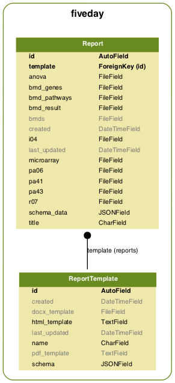
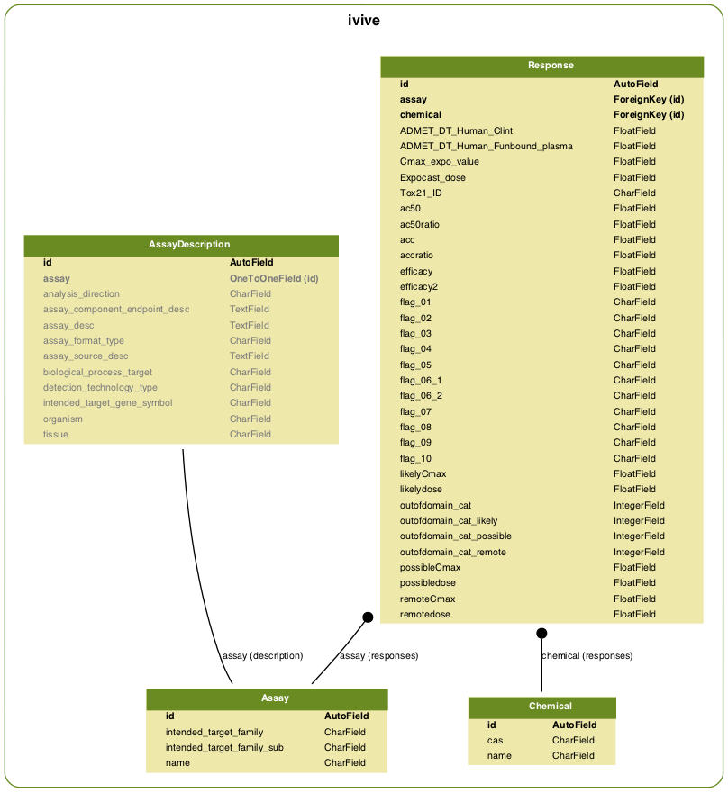
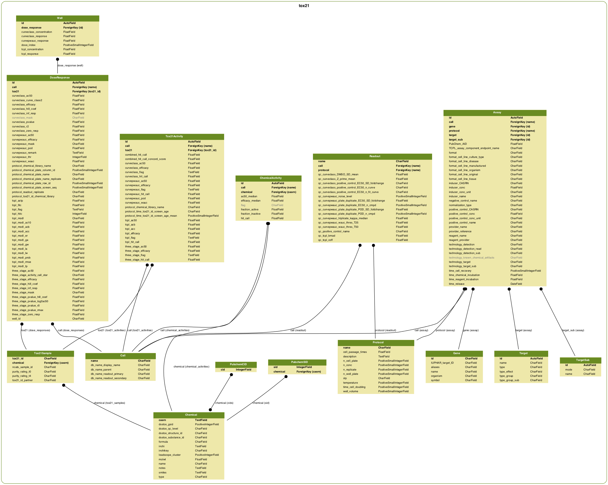
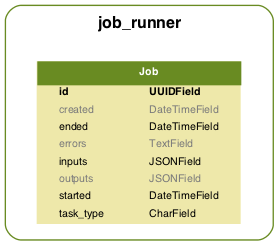

# Django ORM schema definitions

The full database diagram is diagram is shown above. Note that these
diagrams are very large, so you can right click and view all images
in a new browser window to zoom in and explore.            
## fiveday

                 

### fiveday_reporttemplate

- Database table name: fiveday_reporttemplate
- Django model name: fiveday.models.ReportTemplate

**Concrete fields:**

| Name | Type | Attributes     | Help text |
| --- | --- | --- | --- |
| id | AutoField | <ul><li>unique: True</li><li>blank: True</li><li>primary_key: True</li></ul> | 
| name | CharField | <ul><li>max_length: 128</li><li>unique: True</li></ul> | 
| schema | JSONField | <ul><li>default: <class 'dict'></li></ul> | 
| html_template | TextField | <ul></ul> | 
| pdf_template | TextField | <ul><li>blank: True</li></ul> | 
| docx_template | FileField | <ul><li>max_length: 256</li><li>blank: True</li></ul> | 
| created | DateTimeField | <ul><li>blank: True</li></ul> | 
| last_updated | DateTimeField | <ul><li>blank: True</li></ul> | 

**Many to many and reverse relations:**

- ManyToOneRel: [fiveday_report](#fiveday_report)                    

### fiveday_report

- Database table name: fiveday_report
- Django model name: fiveday.models.Report

**Concrete fields:**

| Name | Type | Attributes     | Help text |
| --- | --- | --- | --- |
| id | AutoField | <ul><li>unique: True</li><li>blank: True</li><li>primary_key: True</li></ul> | 
| title | CharField | <ul><li>max_length: 128</li></ul> | 
| template_id (in django: template) | ForeignKey | <ul><li>table: [fiveday_reporttemplate](#fiveday_reporttemplate)</li><li>django model: fiveday.models.ReportTemplate</li><li>null: False</li></ul> | 
| schema_data | JSONField | <ul><li>default: <class 'dict'></li></ul> | 
| microarray | FileField | <ul><li>max_length: 256</li></ul> | 
| anova | FileField | <ul><li>max_length: 256</li></ul> | 
| bmd_result | FileField | <ul><li>max_length: 256</li></ul> | 
| bmd_genes | FileField | <ul><li>max_length: 256</li></ul> | 
| bmd_pathways | FileField | <ul><li>max_length: 256</li></ul> | 
| i04 | FileField | <ul><li>max_length: 256</li></ul> | 
| pa41 | FileField | <ul><li>max_length: 256</li></ul> | 
| pa43 | FileField | <ul><li>max_length: 256</li></ul> | 
| r07 | FileField | <ul><li>max_length: 256</li></ul> | 
| pa06 | FileField | <ul><li>max_length: 256</li></ul> | 
| bmds | FileField | <ul><li>max_length: 256</li><li>blank: True</li><li>null: True</li></ul> | 
| created | DateTimeField | <ul><li>blank: True</li></ul> | 
| last_updated | DateTimeField | <ul><li>blank: True</li></ul> | 

**Many to many and reverse relations:**

## neurotox

                 

### neurotox_assay

- Database table name: neurotox_assay
- Django model name: neurotox.models.Assay

**Concrete fields:**

| Name | Type | Attributes     | Help text |
| --- | --- | --- | --- |
| protocol | CharField | <ul><li>max_length: 64</li><li>unique: True</li><li>primary_key: True</li></ul> | 
| name | CharField | <ul><li>max_length: 128</li></ul> | 
| provider | CharField | <ul><li>max_length: 32</li></ul> | 

**Many to many and reverse relations:**

- ManyToOneRel: [neurotox_plate](#neurotox_plate)                    
- ManyToOneRel: [neurotox_readout](#neurotox_readout)                    

### neurotox_plate

- Database table name: neurotox_plate
- Django model name: neurotox.models.Plate

**Concrete fields:**

| Name | Type | Attributes     | Help text |
| --- | --- | --- | --- |
| id | AutoField | <ul><li>unique: True</li><li>blank: True</li><li>primary_key: True</li></ul> | 
| protocol_id (in django: protocol) | ForeignKey | <ul><li>table: [neurotox_assay](#neurotox_assay)</li><li>django model: neurotox.models.Assay</li><li>null: False</li></ul> | 
| name | CharField | <ul><li>max_length: 64</li></ul> | 
| size | PositiveSmallIntegerField | <ul></ul> | 
| comment | TextField | <ul><li>blank: True</li></ul> | 

**Many to many and reverse relations:**

- ManyToOneRel: [neurotox_well](#neurotox_well)                    

### neurotox_readout

- Database table name: neurotox_readout
- Django model name: neurotox.models.Readout

**Concrete fields:**

| Name | Type | Attributes     | Help text |
| --- | --- | --- | --- |
| id | AutoField | <ul><li>unique: True</li><li>blank: True</li><li>primary_key: True</li></ul> | 
| protocol_id (in django: protocol) | ForeignKey | <ul><li>table: [neurotox_assay](#neurotox_assay)</li><li>django model: neurotox.models.Assay</li><li>null: False</li></ul> | 
| endpoint | CharField | <ul><li>max_length: 64</li></ul> | 
| category | CharField | <ul><li>max_length: 32</li></ul> | 
| is_viability | BooleanField | <ul><li>blank: True</li></ul> | 
| calculate_bmc | BooleanField | <ul><li>blank: True</li></ul> | 
| directionality | SmallIntegerField | <ul><li><ul>choices:<li>-1: Negative only</li><li>0: Negative and positive</li><li>1: Positive only</li><li>999: No direction</li></ul></li></ul> | 

**Many to many and reverse relations:**

- ManyToOneRel: [neurotox_wellresponse](#neurotox_wellresponse)                    
- ManyToOneRel: [neurotox_hill](#neurotox_hill)                    
- ManyToOneRel: [neurotox_curvep](#neurotox_curvep)                    

### neurotox_category

- Database table name: neurotox_category
- Django model name: neurotox.models.Category

**Concrete fields:**

| Name | Type | Attributes     | Help text |
| --- | --- | --- | --- |
| name | CharField | <ul><li>max_length: 32</li><li>unique: True</li><li>primary_key: True</li></ul> | 

**Many to many and reverse relations:**

- ManyToOneRel: [neurotox_chemical](#neurotox_chemical)                    

### neurotox_chemical

- Database table name: neurotox_chemical
- Django model name: neurotox.models.Chemical

**Concrete fields:**

| Name | Type | Attributes     | Help text |
| --- | --- | --- | --- |
| casrn | CharField | <ul><li>max_length: 16</li><li>unique: True</li><li>primary_key: True</li></ul> | 
| name | CharField | <ul><li>max_length: 128</li></ul> | 
| category_id (in django: category) | ForeignKey | <ul><li>table: [neurotox_category](#neurotox_category)</li><li>django model: neurotox.models.Category</li><li>null: True</li></ul> | 
| ntp80 | BooleanField | <ul><li>blank: True</li></ul> | 
| ntp91 | BooleanField | <ul><li>blank: True</li></ul> | 

**Many to many and reverse relations:**

- ManyToOneRel: [neurotox_substance](#neurotox_substance)                    

### neurotox_substance

- Database table name: neurotox_substance
- Django model name: neurotox.models.Substance

**Concrete fields:**

| Name | Type | Attributes     | Help text |
| --- | --- | --- | --- |
| id | AutoField | <ul><li>unique: True</li><li>blank: True</li><li>primary_key: True</li></ul> | 
| lot | CharField | <ul><li>max_length: 16</li><li>blank: True</li></ul> | 
| chemical_id (in django: chemical) | ForeignKey | <ul><li>table: [neurotox_chemical](#neurotox_chemical)</li><li>django model: neurotox.models.Chemical</li><li>null: False</li></ul> | 

**Many to many and reverse relations:**

- ManyToOneRel: [neurotox_well](#neurotox_well)                    
- ManyToOneRel: [neurotox_hill](#neurotox_hill)                    
- ManyToOneRel: [neurotox_curvep](#neurotox_curvep)                    

### neurotox_well

- Database table name: neurotox_well
- Django model name: neurotox.models.Well

**Concrete fields:**

| Name | Type | Attributes     | Help text |
| --- | --- | --- | --- |
| id | AutoField | <ul><li>unique: True</li><li>blank: True</li><li>primary_key: True</li></ul> | 
| plate_id (in django: plate) | ForeignKey | <ul><li>table: [neurotox_plate](#neurotox_plate)</li><li>django model: neurotox.models.Plate</li><li>null: False</li></ul> | 
| row_index | PositiveSmallIntegerField | <ul><li>null: True</li></ul> | 
| column_index | PositiveSmallIntegerField | <ul><li>null: True</li></ul> | 
| substance_id (in django: substance) | ForeignKey | <ul><li>table: [neurotox_substance](#neurotox_substance)</li><li>django model: neurotox.models.Substance</li><li>null: False</li></ul> | 
| vehicle_control | BooleanField | <ul><li>blank: True</li></ul> | 
| positive_control | BooleanField | <ul><li>blank: True</li></ul> | 
| concentration | FloatField | <ul></ul> | 
| chemical_ship_position | CharField | <ul><li>max_length: 4</li><li>blank: True</li></ul> | 

**Many to many and reverse relations:**

- ManyToOneRel: [neurotox_wellresponse](#neurotox_wellresponse)                    

### neurotox_wellresponse

- Database table name: neurotox_wellresponse
- Django model name: neurotox.models.WellResponse

**Concrete fields:**

| Name | Type | Attributes     | Help text |
| --- | --- | --- | --- |
| id | AutoField | <ul><li>unique: True</li><li>blank: True</li><li>primary_key: True</li></ul> | 
| well_id (in django: well) | ForeignKey | <ul><li>table: [neurotox_well](#neurotox_well)</li><li>django model: neurotox.models.Well</li><li>null: False</li></ul> | 
| readout_id (in django: readout) | ForeignKey | <ul><li>table: [neurotox_readout](#neurotox_readout)</li><li>django model: neurotox.models.Readout</li><li>null: False</li></ul> | 
| response_raw | FloatField | <ul><li>null: True</li></ul> | 
| response_normalized | FloatField | <ul><li>null: True</li></ul> | 
| is_outlier | BooleanField | <ul><li>blank: True</li></ul> | 

**Many to many and reverse relations:**

### neurotox_hill

- Database table name: neurotox_hill
- Django model name: neurotox.models.Hill

**Concrete fields:**

| Name | Type | Attributes     | Help text |
| --- | --- | --- | --- |
| id | AutoField | <ul><li>unique: True</li><li>blank: True</li><li>primary_key: True</li></ul> | 
| substance_id (in django: substance) | ForeignKey | <ul><li>table: [neurotox_substance](#neurotox_substance)</li><li>django model: neurotox.models.Substance</li><li>null: False</li></ul> | 
| readout_id (in django: readout) | ForeignKey | <ul><li>table: [neurotox_readout](#neurotox_readout)</li><li>django model: neurotox.models.Readout</li><li>null: False</li></ul> | 
| is_increasing | BooleanField | <ul><li>blank: True</li></ul> | 
| is_active | BooleanField | <ul><li>blank: True</li></ul> | 
| bmd | FloatField | <ul><li>null: True</li></ul> | 
| bmr | FloatField | <ul><li>null: True</li></ul> | 
| bmdl | FloatField | <ul><li>null: True</li></ul> | 
| bmdu | FloatField | <ul><li>null: True</li></ul> | 
| param_vmax | FloatField | <ul><li>null: True</li></ul> | 
| param_k | FloatField | <ul><li>null: True</li></ul> | 
| param_n | FloatField | <ul><li>null: True</li></ul> | 
| selectivity_ratio | FloatField | <ul><li>null: True</li></ul> | 
| has_viability_bmd | BooleanField | <ul><li>blank: True</li></ul> | 

**Many to many and reverse relations:**

### neurotox_curvep

- Database table name: neurotox_curvep
- Django model name: neurotox.models.CurveP

**Concrete fields:**

| Name | Type | Attributes     | Help text |
| --- | --- | --- | --- |
| id | AutoField | <ul><li>unique: True</li><li>blank: True</li><li>primary_key: True</li></ul> | 
| substance_id (in django: substance) | ForeignKey | <ul><li>table: [neurotox_substance](#neurotox_substance)</li><li>django model: neurotox.models.Substance</li><li>null: False</li></ul> | 
| readout_id (in django: readout) | ForeignKey | <ul><li>table: [neurotox_readout](#neurotox_readout)</li><li>django model: neurotox.models.Readout</li><li>null: False</li></ul> | 
| is_increasing | BooleanField | <ul><li>blank: True</li></ul> | 
| is_active | BooleanField | <ul><li>blank: True</li></ul> | 
| bmd | FloatField | <ul><li>null: True</li></ul> | 
| bmr | FloatField | <ul><li>null: True</li></ul> | 
| wauc | FloatField | <ul><li>null: True</li></ul> | 
| emax | FloatField | <ul><li>null: True</li></ul> | 
| doses | ArrayField | <ul></ul> | 
| responses | ArrayField | <ul></ul> | 
| comments | CharField | <ul><li>max_length: 128</li></ul> | 
| selectivity_ratio | FloatField | <ul><li>null: True</li></ul> | 
| has_viability_bmd | BooleanField | <ul><li>blank: True</li></ul> | 

**Many to many and reverse relations:**

## ivive

                 

### ivive_chemical

- Database table name: ivive_chemical
- Django model name: ivive.models.Chemical

**Concrete fields:**

| Name | Type | Attributes     | Help text |
| --- | --- | --- | --- |
| id | AutoField | <ul><li>unique: True</li><li>blank: True</li><li>primary_key: True</li></ul> | 
| name | CharField | <ul><li>max_length: 128</li></ul> | 
| cas | CharField | <ul><li>max_length: 32</li></ul> | 

**Many to many and reverse relations:**

- ManyToManyRel: [ivive_assay](#ivive_assay)                    
- ManyToOneRel: [ivive_response](#ivive_response)                    

### ivive_assay

- Database table name: ivive_assay
- Django model name: ivive.models.Assay

**Concrete fields:**

| Name | Type | Attributes     | Help text |
| --- | --- | --- | --- |
| id | AutoField | <ul><li>unique: True</li><li>blank: True</li><li>primary_key: True</li></ul> | 
| name | CharField | <ul><li>max_length: 128</li></ul> | 
| intended_target_family | CharField | <ul><li>max_length: 128</li></ul> | 
| intended_target_family_sub | CharField | <ul><li>max_length: 128</li></ul> | 

**Many to many and reverse relations:**

- ManyToManyRel: [ivive_chemical](#ivive_chemical)                    
- ManyToOneRel: [ivive_response](#ivive_response)                    
- OneToOneRel: [ivive_assaydescription](#ivive_assaydescription)                    

### ivive_response

- Database table name: ivive_response
- Django model name: ivive.models.Response

**Concrete fields:**

| Name | Type | Attributes     | Help text |
| --- | --- | --- | --- |
| id | AutoField | <ul><li>unique: True</li><li>blank: True</li><li>primary_key: True</li></ul> | 
| chemical_id (in django: chemical) | ForeignKey | <ul><li>table: [ivive_chemical](#ivive_chemical)</li><li>django model: ivive.models.Chemical</li><li>null: True</li></ul> | 
| assay_id (in django: assay) | ForeignKey | <ul><li>table: [ivive_assay](#ivive_assay)</li><li>django model: ivive.models.Assay</li><li>null: True</li></ul> | 
| ADMET_DT_Human_Clint | FloatField | <ul><li>max_length: 128</li></ul> | 
| ADMET_DT_Human_Funbound_plasma | FloatField | <ul><li>max_length: 128</li></ul> | 
| Cmax_expo_value | FloatField | <ul><li>max_length: 128</li></ul> | 
| Expocast_dose | FloatField | <ul><li>max_length: 128</li></ul> | 
| ac50 | FloatField | <ul><li>max_length: 128</li></ul> | 
| ac50ratio | FloatField | <ul><li>max_length: 128</li></ul> | 
| acc | FloatField | <ul><li>max_length: 128</li></ul> | 
| accratio | FloatField | <ul><li>max_length: 128</li></ul> | 
| efficacy | FloatField | <ul><li>max_length: 128</li></ul> | 
| efficacy2 | FloatField | <ul><li>max_length: 128</li></ul> | 
| flag_01 | CharField | <ul><li>max_length: 128</li></ul> | 
| flag_02 | CharField | <ul><li>max_length: 128</li></ul> | 
| flag_03 | CharField | <ul><li>max_length: 128</li></ul> | 
| flag_04 | CharField | <ul><li>max_length: 128</li></ul> | 
| flag_05 | CharField | <ul><li>max_length: 128</li></ul> | 
| flag_06_1 | CharField | <ul><li>max_length: 128</li></ul> | 
| flag_06_2 | CharField | <ul><li>max_length: 128</li></ul> | 
| flag_07 | CharField | <ul><li>max_length: 128</li></ul> | 
| flag_08 | CharField | <ul><li>max_length: 128</li></ul> | 
| flag_09 | CharField | <ul><li>max_length: 128</li></ul> | 
| flag_10 | CharField | <ul><li>max_length: 128</li></ul> | 
| likelydose | FloatField | <ul><li>max_length: 128</li></ul> | 
| possibledose | FloatField | <ul><li>max_length: 128</li></ul> | 
| remotedose | FloatField | <ul><li>max_length: 128</li></ul> | 
| outofdomain_cat | IntegerField | <ul></ul> | 
| outofdomain_cat_likely | IntegerField | <ul></ul> | 
| outofdomain_cat_possible | IntegerField | <ul></ul> | 
| outofdomain_cat_remote | IntegerField | <ul></ul> | 
| likelyCmax | FloatField | <ul><li>max_length: 128</li></ul> | 
| possibleCmax | FloatField | <ul><li>max_length: 128</li></ul> | 
| remoteCmax | FloatField | <ul><li>max_length: 128</li></ul> | 
| Tox21_ID | CharField | <ul><li>max_length: 128</li><li>null: True</li></ul> | 

**Many to many and reverse relations:**

### ivive_assaydescription

- Database table name: ivive_assaydescription
- Django model name: ivive.models.AssayDescription

**Concrete fields:**

| Name | Type | Attributes     | Help text |
| --- | --- | --- | --- |
| id | AutoField | <ul><li>unique: True</li><li>blank: True</li><li>primary_key: True</li></ul> | 
| assay_id (in django: assay) | OneToOneField | <ul><li>table: [ivive_assay](#ivive_assay)</li><li>django model: ivive.models.Assay</li><li>null: True</li></ul> | 
| intended_target_gene_symbol | CharField | <ul><li>max_length: 32</li><li>blank: True</li><li>null: True</li></ul> | 
| assay_source_desc | TextField | <ul><li>blank: True</li><li>null: True</li></ul> | 
| assay_desc | TextField | <ul><li>blank: True</li><li>null: True</li></ul> | 
| organism | CharField | <ul><li>max_length: 128</li><li>blank: True</li><li>null: True</li></ul> | 
| tissue | CharField | <ul><li>max_length: 128</li><li>blank: True</li><li>null: True</li></ul> | 
| assay_format_type | CharField | <ul><li>max_length: 128</li><li>blank: True</li><li>null: True</li></ul> | 
| biological_process_target | CharField | <ul><li>max_length: 128</li><li>blank: True</li><li>null: True</li></ul> | 
| detection_technology_type | CharField | <ul><li>max_length: 128</li><li>blank: True</li><li>null: True</li></ul> | 
| analysis_direction | CharField | <ul><li>max_length: 128</li><li>blank: True</li><li>null: True</li></ul> | 
| assay_component_endpoint_desc | TextField | <ul><li>blank: True</li><li>null: True</li></ul> | 

**Many to many and reverse relations:**

## tox21

                 

### tox21_gene

- Database table name: tox21_gene
- Django model name: tox21.models.Gene

**Concrete fields:**

| Name | Type | Attributes     | Help text |
| --- | --- | --- | --- |
| id | CharField | <ul><li>max_length: 16</li><li>unique: True</li><li>primary_key: True</li></ul> | 
| name | CharField | <ul><li>max_length: 128</li></ul> | 
| symbol | CharField | <ul><li>max_length: 16</li></ul> | 
| aliases | CharField | <ul><li>max_length: 128</li></ul> | 
| organism | CharField | <ul><li>max_length: 32</li></ul> | 
| IUPHAR_target_ID | CharField | <ul><li>max_length: 8</li></ul> | 

**Many to many and reverse relations:**

- ManyToOneRel: [tox21_assay](#tox21_assay)                    

### tox21_targetsub

- Database table name: tox21_targetsub
- Django model name: tox21.models.TargetSub

**Concrete fields:**

| Name | Type | Attributes     | Help text |
| --- | --- | --- | --- |
| id | AutoField | <ul><li>unique: True</li><li>blank: True</li><li>primary_key: True</li></ul> | 
| name | CharField | <ul><li>max_length: 64</li></ul> | 
| mode | CharField | <ul><li>max_length: 32</li></ul> | 

**Many to many and reverse relations:**

- ManyToOneRel: [tox21_assay](#tox21_assay)                    

### tox21_target

- Database table name: tox21_target
- Django model name: tox21.models.Target

**Concrete fields:**

| Name | Type | Attributes     | Help text |
| --- | --- | --- | --- |
| id | AutoField | <ul><li>unique: True</li><li>blank: True</li><li>primary_key: True</li></ul> | 
| name | CharField | <ul><li>max_length: 128</li></ul> | 
| type | CharField | <ul><li>max_length: 64</li></ul> | 
| type_group | CharField | <ul><li>max_length: 32</li></ul> | 
| type_group_sub | CharField | <ul><li>max_length: 64</li></ul> | 
| type_effect | CharField | <ul><li>max_length: 8</li></ul> | 

**Many to many and reverse relations:**

- ManyToOneRel: [tox21_assay](#tox21_assay)                    

### tox21_protocol

- Database table name: tox21_protocol
- Django model name: tox21.models.Protocol

**Concrete fields:**

| Name | Type | Attributes     | Help text |
| --- | --- | --- | --- |
| name | CharField | <ul><li>max_length: 64</li><li>unique: True</li><li>primary_key: True</li></ul> | 
| slp | CharField | <ul><li>max_length: 64</li></ul> | 
| description | TextField | <ul><li>unique: True</li></ul> | 
| time_cell_doubling | PositiveSmallIntegerField | <ul></ul> | 
| cell_passage_times | FloatField | <ul><li>null: True</li></ul> | 
| temperature | PositiveSmallIntegerField | <ul></ul> | 
| well_volume | PositiveSmallIntegerField | <ul></ul> | 
| n_well_plate | PositiveSmallIntegerField | <ul></ul> | 
| n_conc | PositiveSmallIntegerField | <ul></ul> | 
| n_replicate | PositiveSmallIntegerField | <ul></ul> | 
| n_cell_plate | PositiveSmallIntegerField | <ul></ul> | 

**Many to many and reverse relations:**

- ManyToOneRel: [tox21_assay](#tox21_assay)                    
- ManyToOneRel: [tox21_readout](#tox21_readout)                    

### tox21_call

- Database table name: tox21_call
- Django model name: tox21.models.Call

**Concrete fields:**

| Name | Type | Attributes     | Help text |
| --- | --- | --- | --- |
| name | CharField | <ul><li>max_length: 64</li><li>unique: True</li><li>primary_key: True</li></ul> | 
| db_name_parent | CharField | <ul><li>max_length: 64</li></ul> | 
| db_name_readout_primary | CharField | <ul><li>max_length: 64</li><li>unique: True</li></ul> | 
| db_name_readout_secondary | CharField | <ul><li>max_length: 128</li></ul> | 
| db_name_display_name | CharField | <ul><li>max_length: 256</li></ul> | 

**Many to many and reverse relations:**

- ManyToOneRel: [tox21_assay](#tox21_assay)                    
- ManyToOneRel: [tox21_readout](#tox21_readout)                    
- ManyToOneRel: [tox21_chemicalactivity](#tox21_chemicalactivity)                    
- ManyToOneRel: [tox21_tox21activity](#tox21_tox21activity)                    
- ManyToOneRel: [tox21_doseresponse](#tox21_doseresponse)                    

### tox21_assay

- Database table name: tox21_assay
- Django model name: tox21.models.Assay

**Concrete fields:**

| Name | Type | Attributes     | Help text |
| --- | --- | --- | --- |
| id | AutoField | <ul><li>unique: True</li><li>blank: True</li><li>primary_key: True</li></ul> | 
| call_id (in django: call) | ForeignKey | <ul><li>table: [tox21_call](#tox21_call)</li><li>django model: tox21.models.Call</li><li>null: False</li></ul> | 
| gene_id (in django: gene) | ForeignKey | <ul><li>table: [tox21_gene](#tox21_gene)</li><li>django model: tox21.models.Gene</li><li>null: True</li></ul> | 
| protocol_id (in django: protocol) | ForeignKey | <ul><li>table: [tox21_protocol](#tox21_protocol)</li><li>django model: tox21.models.Protocol</li><li>null: False</li></ul> | 
| target_id (in django: target) | ForeignKey | <ul><li>table: [tox21_target](#tox21_target)</li><li>django model: tox21.models.Target</li><li>null: False</li></ul> | 
| target_sub_id (in django: target_sub) | ForeignKey | <ul><li>table: [tox21_targetsub](#tox21_targetsub)</li><li>django model: tox21.models.TargetSub</li><li>null: False</li></ul> | 
| PubChem_AID | FloatField | <ul><li>null: True</li></ul> | 
| TCPL_assay_component_endpoint_name | CharField | <ul><li>max_length: 64</li></ul> | 
| time_release | DateField | <ul><li>null: True</li></ul> | 
| technology_known_chemical_artifacts | CharField | <ul><li>max_length: 128</li><li>blank: True</li></ul> | 
| technology_target | CharField | <ul><li>max_length: 64</li></ul> | 
| technology_target_sub | CharField | <ul><li>max_length: 64</li></ul> | 
| technology_detection | CharField | <ul><li>max_length: 64</li></ul> | 
| technology_detection_sub | CharField | <ul><li>max_length: 64</li></ul> | 
| technology_detection_read | CharField | <ul><li>max_length: 16</li></ul> | 
| provider_name | CharField | <ul><li>max_length: 32</li></ul> | 
| provider_reference | CharField | <ul><li>max_length: 64</li></ul> | 
| format | CharField | <ul><li>max_length: 16</li></ul> | 
| format_cell_line_original | CharField | <ul><li>max_length: 16</li></ul> | 
| format_cell_line_manufactured | CharField | <ul><li>max_length: 64</li></ul> | 
| format_cell_line_culture_type | CharField | <ul><li>max_length: 8</li></ul> | 
| format_cell_line_tissue | CharField | <ul><li>max_length: 128</li></ul> | 
| format_cell_line_disease | CharField | <ul><li>max_length: 32</li></ul> | 
| format_cell_line_organism | CharField | <ul><li>max_length: 32</li></ul> | 
| reagent_name | CharField | <ul><li>max_length: 64</li></ul> | 
| reagent_provider | CharField | <ul><li>max_length: 32</li></ul> | 
| inducer_name | CharField | <ul><li>max_length: 128</li></ul> | 
| inducer_CASRN | CharField | <ul><li>max_length: 16</li></ul> | 
| inducer_conc | FloatField | <ul><li>null: True</li></ul> | 
| inducer_conc_unit | CharField | <ul><li>max_length: 16</li></ul> | 
| time_cell_recovery | PositiveSmallIntegerField | <ul></ul> | 
| time_chemical_incubation | FloatField | <ul></ul> | 
| time_reagent_incubation | FloatField | <ul></ul> | 
| normalization_type | CharField | <ul><li>max_length: 128</li></ul> | 
| positive_control_name | CharField | <ul><li>max_length: 128</li></ul> | 
| positive_control_CASRN | CharField | <ul><li>max_length: 16</li></ul> | 
| positive_control_conc | FloatField | <ul><li>null: True</li></ul> | 
| positive_control_conc_unit | CharField | <ul><li>max_length: 16</li></ul> | 
| negative_control_name | CharField | <ul><li>max_length: 32</li></ul> | 

**Many to many and reverse relations:**

### tox21_readout

- Database table name: tox21_readout
- Django model name: tox21.models.Readout

**Concrete fields:**

| Name | Type | Attributes     | Help text |
| --- | --- | --- | --- |
| protocol_id (in django: protocol) | ForeignKey | <ul><li>table: [tox21_protocol](#tox21_protocol)</li><li>django model: tox21.models.Protocol</li><li>null: False</li></ul> | 
| call_id (in django: call) | ForeignKey | <ul><li>table: [tox21_call](#tox21_call)</li><li>django model: tox21.models.Call</li><li>null: False</li></ul> | 
| name | CharField | <ul><li>max_length: 64</li><li>unique: True</li><li>primary_key: True</li></ul> | 
| qc_curvepwauc_plate_duplicate_POD_n_cmpd | PositiveSmallIntegerField | <ul></ul> | 
| qc_curvepwauc_plate_duplicate_POD_SD_foldchange | FloatField | <ul></ul> | 
| qc_curvepwauc_plate_duplicate_EC50_SD_foldchange | FloatField | <ul></ul> | 
| qc_curvepwauc_triplicate_kappa_median | FloatField | <ul></ul> | 
| qc_curvepwauc_wauc_thres_T25 | FloatField | <ul></ul> | 
| qc_curvepwauc_wauc_thres_T50 | FloatField | <ul></ul> | 
| qc_curvepwauc_noise_level | PositiveSmallIntegerField | <ul></ul> | 
| qc_curvepwauc_plate_duplicate_EC50_n_cmpd | PositiveSmallIntegerField | <ul></ul> | 
| qc_tcpl_bmad | FloatField | <ul><li>null: True</li></ul> | 
| qc_tcpl_coff | FloatField | <ul><li>null: True</li></ul> | 
| qc_curveclass_Z_prime_mean | FloatField | <ul><li>null: True</li></ul> | 
| qc_curveclass_DMSO_SD_mean | FloatField | <ul><li>null: True</li></ul> | 
| qc_positive_control_name | CharField | <ul><li>max_length: 128</li></ul> | 
| qc_curveclass_positive_control_EC50_SD_foldchange | CharField | <ul><li>max_length: 16</li></ul> | 
| qc_curveclass_positive_control_EC50_n_fit_curve | CharField | <ul><li>max_length: 8</li></ul> | 
| qc_curveclass_positive_control_EC50_n_curve | CharField | <ul><li>max_length: 8</li></ul> | 

**Many to many and reverse relations:**

### tox21_chemical

- Database table name: tox21_chemical
- Django model name: tox21.models.Chemical

**Concrete fields:**

| Name | Type | Attributes     | Help text |
| --- | --- | --- | --- |
| casrn | TextField | <ul><li>unique: True</li><li>primary_key: True</li></ul> | 
| name | CharField | <ul><li>max_length: 256</li></ul> | 
| smiles | TextField | <ul></ul> | 
| inchi | TextField | <ul></ul> | 
| inchikey | CharField | <ul><li>max_length: 32</li></ul> | 
| formula | CharField | <ul><li>max_length: 32</li></ul> | 
| molwt | FloatField | <ul><li>null: True</li></ul> | 
| type | CharField | <ul><li>max_length: 32</li></ul> | 
| notes | TextField | <ul></ul> | 
| dsstox_gsid | PositiveIntegerField | <ul></ul> | 
| dsstox_substance_id | CharField | <ul><li>max_length: 16</li></ul> | 
| dsstox_structure_id | CharField | <ul><li>max_length: 16</li></ul> | 
| dsstox_qc_level | CharField | <ul><li>max_length: 16</li></ul> | 
| leadscope_cluster | PositiveIntegerField | <ul></ul> | 

**Many to many and reverse relations:**

- ManyToOneRel: [tox21_pubchemsid](#tox21_pubchemsid)                    
- ManyToManyRel: [tox21_pubchemcid](#tox21_pubchemcid)                    
- ManyToOneRel: [tox21_tox21sample](#tox21_tox21sample)                    
- ManyToOneRel: [tox21_chemicalactivity](#tox21_chemicalactivity)                    

### tox21_pubchemsid

- Database table name: tox21_pubchemsid
- Django model name: tox21.models.PubchemSID

**Concrete fields:**

| Name | Type | Attributes     | Help text |
| --- | --- | --- | --- |
| sid | IntegerField | <ul><li>unique: True</li><li>primary_key: True</li></ul> | 
| chemical_id (in django: chemical) | ForeignKey | <ul><li>table: [tox21_chemical](#tox21_chemical)</li><li>django model: tox21.models.Chemical</li><li>null: False</li></ul> | 

**Many to many and reverse relations:**

### tox21_pubchemcid

- Database table name: tox21_pubchemcid
- Django model name: tox21.models.PubchemCID

**Concrete fields:**

| Name | Type | Attributes     | Help text |
| --- | --- | --- | --- |
| cid | IntegerField | <ul><li>unique: True</li><li>primary_key: True</li></ul> | 

**Many to many and reverse relations:**

### tox21_tox21sample

- Database table name: tox21_tox21sample
- Django model name: tox21.models.Tox21Sample

**Concrete fields:**

| Name | Type | Attributes     | Help text |
| --- | --- | --- | --- |
| tox21_id | CharField | <ul><li>max_length: 64</li><li>unique: True</li><li>primary_key: True</li></ul> | 
| chemical_id (in django: chemical) | ForeignKey | <ul><li>table: [tox21_chemical](#tox21_chemical)</li><li>django model: tox21.models.Chemical</li><li>null: False</li></ul> | 
| tox21_id_partner | CharField | <ul><li>max_length: 16</li></ul> | 
| ncats_sample_id | CharField | <ul><li>max_length: 16</li></ul> | 
| purity_rating_t0 | CharField | <ul><li>max_length: 4</li></ul> | 
| purity_rating_t4 | CharField | <ul><li>max_length: 4</li></ul> | 

**Many to many and reverse relations:**

- ManyToOneRel: [tox21_tox21activity](#tox21_tox21activity)                    
- ManyToOneRel: [tox21_doseresponse](#tox21_doseresponse)                    

### tox21_chemicalactivity

- Database table name: tox21_chemicalactivity
- Django model name: tox21.models.ChemicalActivity

**Concrete fields:**

| Name | Type | Attributes     | Help text |
| --- | --- | --- | --- |
| id | AutoField | <ul><li>unique: True</li><li>blank: True</li><li>primary_key: True</li></ul> | 
| chemical_id (in django: chemical) | ForeignKey | <ul><li>table: [tox21_chemical](#tox21_chemical)</li><li>django model: tox21.models.Chemical</li><li>null: False</li></ul> | 
| call_id (in django: call) | ForeignKey | <ul><li>table: [tox21_call](#tox21_call)</li><li>django model: tox21.models.Call</li><li>null: False</li></ul> | 
| hit_call | FloatField | <ul></ul> | 
| flag | CharField | <ul><li>max_length: 64</li><li>blank: True</li></ul> | 
| fraction_active | FloatField | <ul><li>null: True</li></ul> | 
| fraction_inactive | FloatField | <ul><li>null: True</li></ul> | 
| ac50_median | FloatField | <ul><li>null: True</li></ul> | 
| efficacy_median | FloatField | <ul><li>null: True</li></ul> | 

**Many to many and reverse relations:**

### tox21_tox21activity

- Database table name: tox21_tox21activity
- Django model name: tox21.models.Tox21Activity

**Concrete fields:**

| Name | Type | Attributes     | Help text |
| --- | --- | --- | --- |
| id | AutoField | <ul><li>unique: True</li><li>blank: True</li><li>primary_key: True</li></ul> | 
| tox21_id (in django: tox21) | ForeignKey | <ul><li>table: [tox21_tox21sample](#tox21_tox21sample)</li><li>django model: tox21.models.Tox21Sample</li><li>null: False</li></ul> | 
| call_id (in django: call) | ForeignKey | <ul><li>table: [tox21_call](#tox21_call)</li><li>django model: tox21.models.Call</li><li>null: False</li></ul> | 
| protocol_chemical_library_name | CharField | <ul><li>max_length: 64</li></ul> | 
| protocol_time_tox21_id_screen_age_mean | PositiveSmallIntegerField | <ul></ul> | 
| protocol_time_tox21_id_screen_age | CharField | <ul><li>max_length: 32</li></ul> | 
| three_stage_hit_call | FloatField | <ul><li>null: True</li></ul> | 
| three_stage_ac50 | FloatField | <ul><li>null: True</li></ul> | 
| three_stage_efficacy | FloatField | <ul><li>null: True</li></ul> | 
| three_stage_flag | TextField | <ul></ul> | 
| curveclass_hit_call | FloatField | <ul><li>null: True</li></ul> | 
| curveclass_ac50 | FloatField | <ul><li>null: True</li></ul> | 
| curveclass_efficacy | FloatField | <ul><li>null: True</li></ul> | 
| curveclass_flag | TextField | <ul></ul> | 
| curvepwauc_hit_call | FloatField | <ul></ul> | 
| curvepwauc_ac50 | FloatField | <ul><li>null: True</li></ul> | 
| curvepwauc_efficacy | FloatField | <ul><li>null: True</li></ul> | 
| curvepwauc_pod | FloatField | <ul><li>null: True</li></ul> | 
| curvepwauc_wauc | FloatField | <ul></ul> | 
| curvepwauc_flag | TextField | <ul></ul> | 
| tcpl_hit_call | FloatField | <ul><li>null: True</li></ul> | 
| tcpl_ac50 | FloatField | <ul><li>null: True</li></ul> | 
| tcpl_efficacy | FloatField | <ul><li>null: True</li></ul> | 
| tcpl_acb | FloatField | <ul><li>null: True</li></ul> | 
| tcpl_acc | FloatField | <ul><li>null: True</li></ul> | 
| tcpl_flag | TextField | <ul></ul> | 
| combined_hit_call | FloatField | <ul></ul> | 
| combined_hit_call_concord_score | FloatField | <ul></ul> | 

**Many to many and reverse relations:**

### tox21_doseresponse

- Database table name: tox21_doseresponse
- Django model name: tox21.models.DoseResponse

**Concrete fields:**

| Name | Type | Attributes     | Help text |
| --- | --- | --- | --- |
| id | AutoField | <ul><li>unique: True</li><li>blank: True</li><li>primary_key: True</li></ul> | 
| tox21_id (in django: tox21) | ForeignKey | <ul><li>table: [tox21_tox21sample](#tox21_tox21sample)</li><li>django model: tox21.models.Tox21Sample</li><li>null: False</li></ul> | 
| call_id (in django: call) | ForeignKey | <ul><li>table: [tox21_call](#tox21_call)</li><li>django model: tox21.models.Call</li><li>null: False</li></ul> | 
| well_id | CharField | <ul><li>max_length: 8</li></ul> | 
| protocol_tox21_id_chemical_library | CharField | <ul><li>max_length: 32</li></ul> | 
| protocol_readout_replicate | CharField | <ul><li>max_length: 16</li></ul> | 
| protocol_chemical_plate_name | CharField | <ul><li>max_length: 32</li></ul> | 
| protocol_chemical_plate_name_replicate | CharField | <ul><li>max_length: 8</li></ul> | 
| protocol_chemical_plate_screen_seq | PositiveSmallIntegerField | <ul></ul> | 
| protocol_chemical_plate_row_id | PositiveSmallIntegerField | <ul></ul> | 
| protocol_chemical_plate_column_id | PositiveSmallIntegerField | <ul></ul> | 
| protocol_chemical_library_name | CharField | <ul><li>max_length: 8</li></ul> | 
| curvepwauc_wauc | FloatField | <ul><li>null: True</li></ul> | 
| curvepwauc_pod | FloatField | <ul><li>null: True</li></ul> | 
| curvepwauc_thr | IntegerField | <ul><li>null: True</li></ul> | 
| curvepwauc_ac50 | FloatField | <ul><li>null: True</li></ul> | 
| curvepwauc_efficacy | FloatField | <ul><li>null: True</li></ul> | 
| curvepwauc_remark | TextField | <ul></ul> | 
| curvepwauc_mask | CharField | <ul><li>max_length: 32</li></ul> | 
| curveclass_efficacy | FloatField | <ul><li>null: True</li></ul> | 
| curveclass_curve_class2 | FloatField | <ul><li>null: True</li></ul> | 
| curveclass_ac50 | FloatField | <ul><li>null: True</li></ul> | 
| curveclass_hill_coef | FloatField | <ul><li>null: True</li></ul> | 
| curveclass_inf_resp | FloatField | <ul><li>null: True</li></ul> | 
| curveclass_zero_resp | FloatField | <ul><li>null: True</li></ul> | 
| curveclass_r2 | FloatField | <ul><li>null: True</li></ul> | 
| curveclass_pvalue | FloatField | <ul><li>null: True</li></ul> | 
| curveclass_mask | CharField | <ul><li>max_length: 32</li><li>blank: True</li></ul> | 
| three_stage_zero_resp | FloatField | <ul><li>null: True</li></ul> | 
| three_stage_inf_resp | FloatField | <ul><li>null: True</li></ul> | 
| three_stage_hill_coef | FloatField | <ul><li>null: True</li></ul> | 
| three_stage_ac50 | FloatField | <ul><li>null: True</li></ul> | 
| three_stage_mask | CharField | <ul><li>max_length: 32</li></ul> | 
| three_stage_pvalue_rmax | FloatField | <ul><li>null: True</li></ul> | 
| three_stage_pvalue_hill_coef | FloatField | <ul><li>null: True</li></ul> | 
| three_stage_pvalue_log2ac50 | FloatField | <ul><li>null: True</li></ul> | 
| three_stage_pvalue_r0 | FloatField | <ul><li>null: True</li></ul> | 
| three_stage_activity_call_star | CharField | <ul><li>max_length: 32</li></ul> | 
| three_stage_efficacy | FloatField | <ul><li>null: True</li></ul> | 
| tcpl_hitc | IntegerField | <ul></ul> | 
| tcpl_fitc | FloatField | <ul><li>null: True</li></ul> | 
| tcpl_actp | FloatField | <ul><li>null: True</li></ul> | 
| tcpl_modl | CharField | <ul><li>max_length: 4</li></ul> | 
| tcpl_modl_er | FloatField | <ul><li>null: True</li></ul> | 
| tcpl_modl_tp | FloatField | <ul><li>null: True</li></ul> | 
| tcpl_modl_ga | FloatField | <ul><li>null: True</li></ul> | 
| tcpl_modl_gw | FloatField | <ul><li>null: True</li></ul> | 
| tcpl_modl_la | FloatField | <ul><li>null: True</li></ul> | 
| tcpl_modl_lw | FloatField | <ul><li>null: True</li></ul> | 
| tcpl_modl_rmse | FloatField | <ul><li>null: True</li></ul> | 
| tcpl_modl_prob | FloatField | <ul><li>null: True</li></ul> | 
| tcpl_modl_acc | FloatField | <ul><li>null: True</li></ul> | 
| tcpl_modl_acb | FloatField | <ul><li>null: True</li></ul> | 
| tcpl_modl_ac10 | FloatField | <ul><li>null: True</li></ul> | 
| tcpl_flag | TextField | <ul></ul> | 

**Many to many and reverse relations:**

- ManyToOneRel: [tox21_well](#tox21_well)                    

### tox21_well

- Database table name: tox21_well
- Django model name: tox21.models.Well

**Concrete fields:**

| Name | Type | Attributes     | Help text |
| --- | --- | --- | --- |
| id | AutoField | <ul><li>unique: True</li><li>blank: True</li><li>primary_key: True</li></ul> | 
| dose_response_id (in django: dose_response) | ForeignKey | <ul><li>table: [tox21_doseresponse](#tox21_doseresponse)</li><li>django model: tox21.models.DoseResponse</li><li>null: False</li></ul> | 
| dose_index | PositiveSmallIntegerField | <ul></ul> | 
| tcpl_concentration | FloatField | <ul><li>null: True</li></ul> | 
| tcpl_response | FloatField | <ul><li>null: True</li></ul> | 
| curveclass_concentration | FloatField | <ul><li>null: True</li></ul> | 
| curveclass_response | FloatField | <ul><li>null: True</li></ul> | 
| curvepwauc_response | FloatField | <ul><li>null: True</li></ul> | 

**Many to many and reverse relations:**

## job_runner

                 

### job_runner_job

- Database table name: job_runner_job
- Django model name: job_runner.models.Job

**Concrete fields:**

| Name | Type | Attributes     | Help text |
| --- | --- | --- | --- |
| id | UUIDField | <ul><li>max_length: 32</li><li>unique: True</li><li>default: <function uuid4 at 0x108367ae8></li><li>primary_key: True</li></ul> | 
| task_type | CharField | <ul><li>max_length: 50</li><li><ul>choices:<li>TEST: Test job</li><li>TEST R: Test R job</li><li>BMDS Dose Response: BMDS dose response modeling</li><li>BMDS Dfile: BMDS dfile runner</li><li>CASRN_TO_SMILES: CASRN to SMILES</li></ul></li></ul> | 
| inputs | JSONField | <ul></ul> | 
| outputs | JSONField | <ul><li>blank: True</li><li>null: True</li></ul> | 
| errors | TextField | <ul><li>blank: True</li></ul> | 
| created | DateTimeField | <ul><li>blank: True</li></ul> | 
| started | DateTimeField | <ul><li>null: True</li></ul> | 
| ended | DateTimeField | <ul><li>null: True</li></ul> | 

**Many to many and reverse relations:**

